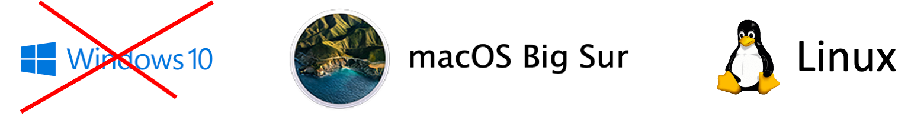
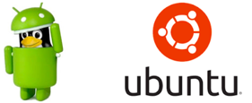

```{r setup, echo= FALSE}
knitr::opts_chunk$set(include = FALSE)

# https://github.com/garthtarr/sydney_xaringan is useful

source("../../helpers/color_funs.R") # includes red function

xaringanExtra::use_tile_view()

```


# What is UNIX?

+ It is an operating system (it talks to the hardware and controls files on your computer or phone).

.center[]

+ You can interact with point-and-click tools or type commands.


+ Most people associate UNIX with Linux (Tux the penguin) and/or .red["Ubuntu"] (a flavor of Unix), but the most popular UNIX-based systems are .red["Mac OS"] and .red["Android"].


.center[]

<div class="my-footer">
.tiny[https://www.junauza.com/2012/04/how-to-manage-android-devices-on-linux.html]
</div> 

---

# Interacting with UNIX


+ The core of an operating system (what talks to the hardware) is called the .red["kernel"].  


+ The part that a user can interact with is called the .red[shell].

+ There are many different shells.  
Bourne, Korn, POSIX, Bourne Again Shell .red[(bash)]. 

+ You type commands to run programs.
  + For example, you can run a program called .red[`git`] to backup your files or a program called .red[`find`] to find files.

---

# Set Up Bash Shell/Git

+ Why use a shell?
  + It is .red["faster"] to type than mouse

+ Bash is the most popular UNIX shell.
+ Mac has the terminal app preinstalled.
  + Type ⌘ spacebar and then type `terminal` and push the return key.  Right click it to add it to your dock.
  + The Mac terminal runs `bash` (the most modern Macs ship with zsh instead of Bash by default) and has software including `git` already installed.
+ If you use Windows, download and install the Bash shell  
    + The git instalation for windows includes `bash` 
    + Go here: https://git-for-windows.github.io/ 

---

# How does UNIX work?

+ UNIX commands are short "words" followed by options.
+ The command to use git is … `git`
    + The command by itself is mostly useless.
+ You add options by typing them after `git`
  + sometimes they are just a word 
  + sometimes .blue[`-`] then a letter
  + sometimes .blue[`--`] then a word
    
---

# Pipe and Redirect

With the UNIX pipe .blue[`|`] and redirect .blue[`>`] or .blue[`>>`]  characters, simple verbs can be joined together to make complex workflows (just like pipes in dplyr) within a single command. 

.center[.blue[`find`] `folder1 folder2 -name "*.txt" -print0 |` .blue[`sort`] `-z`]

You can redirect output into a new file with a .blue[`>`]

.center[.blue[`ls >`] stuff.txt]

You can append output into the bottom of a text file with .blue[`>>`]

.center[.blue[`echo`] "the stuff" .blue[`>>`] stuff.txt]

---

# UNIX Commands Ray Will Type (by reflex)

.small[
| Command | It means: |
| ------- | --------- |
| pwd | Show me where I am (present working directory).| 
| cd blah | Change into the subdirectory (child directory) of this directory called blah.| 
| cd .. | Change into the directory holding this one (parent directory). | 
| cd ~ | Go to my home directory.| 
| ls | List stuff in this directory.| 
| ls -a | List all the stuff in this directory. | 
| ls -l | List stuff in long form.| 
| touch blah | Make a file called blah. | 
| open blah | Open a file called blah. | 
| rm blah | Delete a file called blah. (remove) | 
| mkdir | Make a directory balled blah | 
]

