```{r setup, echo= FALSE}
knitr::opts_chunk$set(include = FALSE)

# https://github.com/garthtarr/sydney_xaringan is useful

source("../../helpers/color_funs.R")
```

class: segue-gold


`Git` - WHAT

---

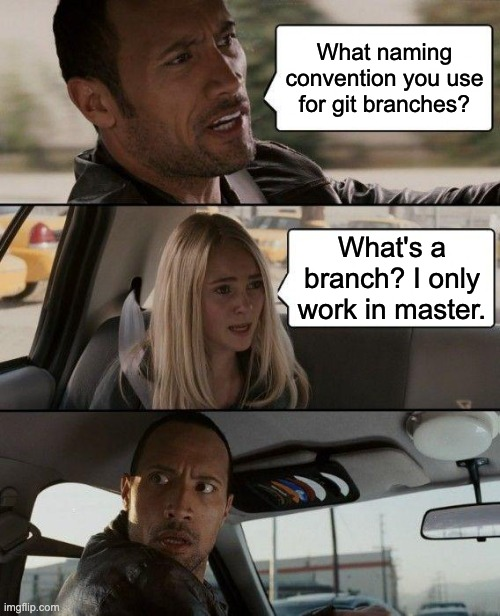
---

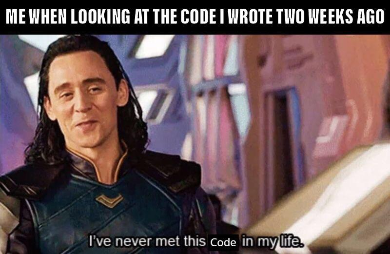

---

# What is `Git`?

.pull-left[

Version control system from the .red[Unix] operating system. It allows you to track history of changes as people and teams collaborate with confidence. 

### But .orange[why??]

Because *this*    ➡️ ☠️

</br>

*Does anyone see any problems with this method?*

]

.pull-right[
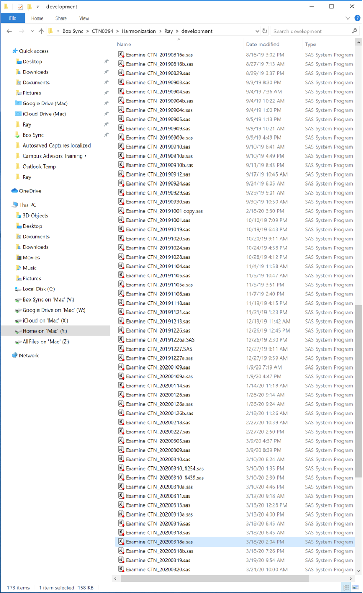
]

???
But actually, you an review a projects history to find out which changes were made, who made the changes, when were the changes made and why the changes were needed.
+ You end up with dozens or hundreds of versions.
+ What happens when somebody else needs to work on the code at the same time?

---

class: segue-gold

`Git` - THE BASICS

---

## Concepts you should know: 👩🏽‍🏫

- Repository
  - .li-sub[Local vs. Remote]

--
- Staging Area
  - .li-sub[vs. Working Directory]

--
- Commit
  - .li-sub[Diff]

--
- Branching
  - .li-sub[`Main`]

--
- Clone

--
- Push/Pull Request (PR)
  - .li-sub[Merge]
  
--
- Pull

---

## Repository (repo) 📁

+ A Git project - the whole collection of files and folders associated with a projects and their revision history

.pull-left[
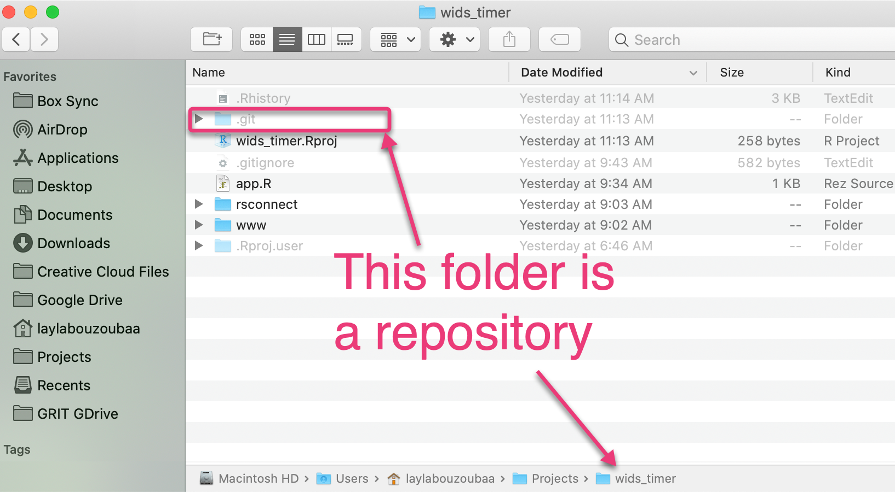
]
.pull-right[
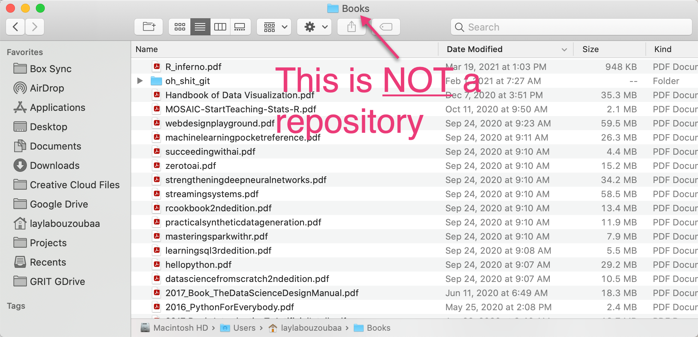
]
</br>

.purple[Local] Git repos live on your own computer. They may not reflect changes others have made on the .blue[Central] (remote) Git repo.

???
A file that contains git.

---
class: center

## One more time 🤔 

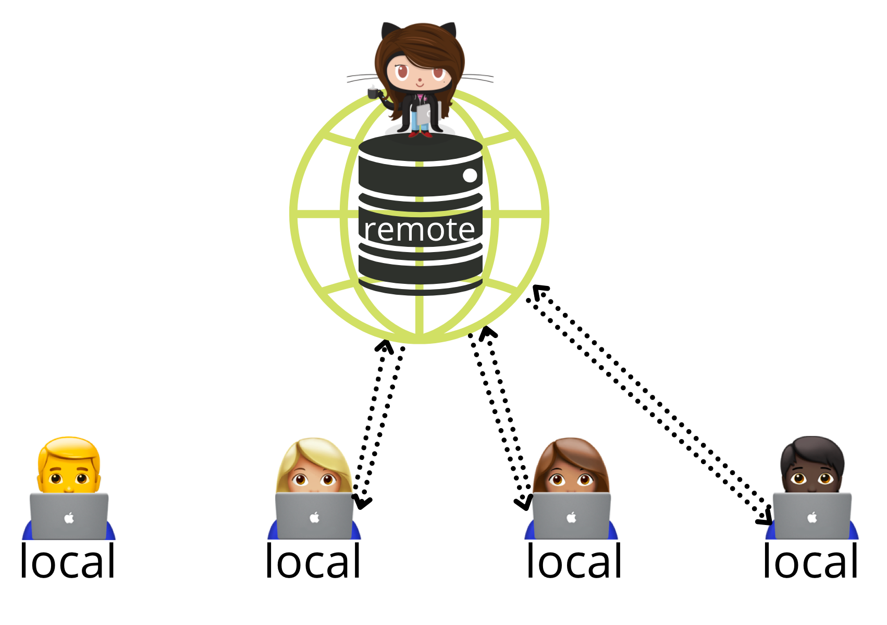

---

## Commits

.pull-left[

+ Semi-permanent snapshots of your project 📸
+ They capture the current state of your repository and carry a linked-list relationship
  + all .purple[commits] are linked 
  + These lists development histories can be organized into .blue[branches] 🎋 (hold this thought)
]

.pull-right[
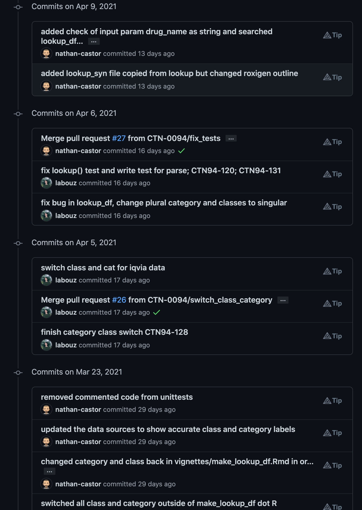
]

???
semi-permanent because commits are meant to permanents store changes however they can be deleted but it's a pain in a**.


all .purple[commits] are linked so that if you make a mistake, you can travel up the list several commits and revert your project to that state.

---
## Commits - a deeper dive 🤿

+ As you work on a project, you make changes on what is called a .red[working directory]

  + .li-sub[The directory in which your `.git` folder lives]
  
  + .li-sub[Can be your own local project or you can pull down the central repository of another project and have your own working directory]

#### How is this relevant to a .purple[commit]?

+ Changes to your .red[working directory] must be .orange[staged] before they can be committed
  + .li-sub[.orange[Staging] tells Git you want to include updates to a file in the next .purple[commit]. ]
  + .li-sub[.orange[Staging] can be undone and does not affect your repo in any way]
  + .li-sub[Save the contents in the .orange[staging area] with a .purple[COMMIT]]
  
???
Yes, you can be working off a directory that is NOT the working directory. Ask us about it!
Pulling down the central repo of another's project is called "cloning". When you clone, you also get the change history from your collaborators!
Committed snapshots can be thought of as “safe” versions of a project—Git will never change them unless you explicitly ask it to.

---
class: center

## Staging -> Commits - Break it Down

</br>


---
## Back to the 🎋

.pull-left[

+ To recap:

  1. Make changes in your .red[working directory]
  1. Take a snapshot of those changes by adding them to the .orange[staging area]
  1. Permanently store those changes to your repo by .purple[committing] them.
+ One of the BIGGEST advantages is being able to store your development in .green[branches]
]
.pull-right[
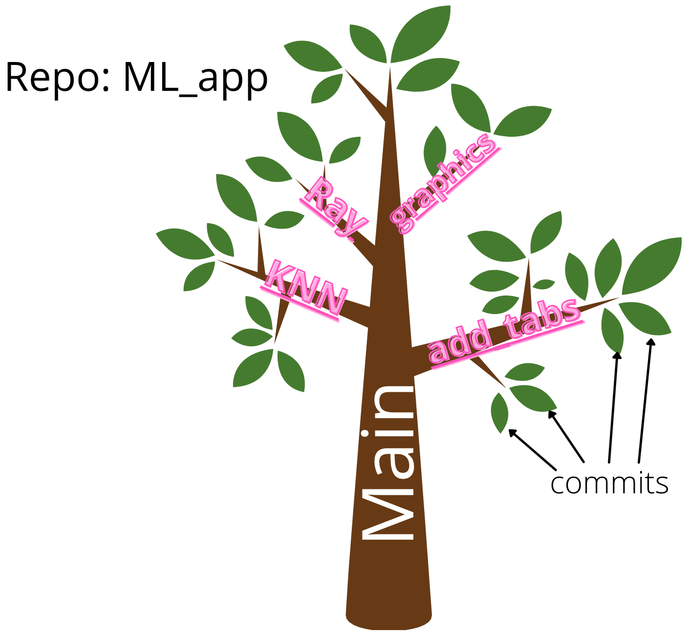
]

???
all files must be added to staging before they can be committed but new files won't be tracked by Git unless it is added to staging. 
branching lets you alter the working copy of the repository i
---
## Puuuushhh!

+ When you are ready to share your changes with others .red[PUSH] them (and your branch) to the central repository!
+ You can keep pushing new commits (changes) to your branch until you are ready to make your modifications a permanent part of `main`
  + .li-sub[rule of 👍 #1: a new branch should correspond to a new feature and have a meaningful name]
  + .li-sub[rule of 👍 #2: a commit should reflect a significant modification to your code]
  + .li-sub[rule of 👍 #3: a commit message should be about 50 chars and effectivetly communicate the context of your changes - your future self will thank you 😉]

.pull-left[
You push your changes to let others access the changes you've made!
]
.pull-right[
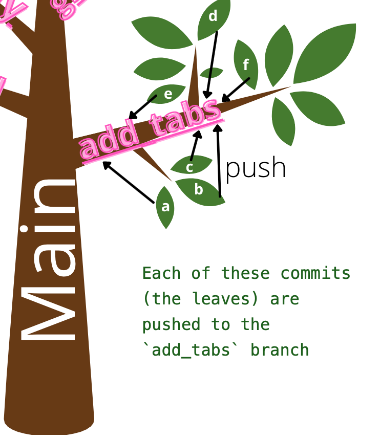
]

???
commit messages should be limited to 50 characters and should communicate context about a change to others and your future self
---
## How do I make what's in my branch part of `main`?

**A Pull Request (PR)!** a.k.a the fun part 🎂

.pull-left[
+ With a .red[PR] you are opening your changes to discussion with your collaborators
  + .li-sub[Here it's a good idea to do a .orange[code review] with one of your teammates to make sure there are no damaging bugs in your code and to make sure you're on the same page about what you are proposing to change]
  + .li-sub[PR's are one of the most important steps in good collaboration. It opens line of communication and strategy. If necessary, you can push follow-up commits based on feedback.]
]
.pull-right[
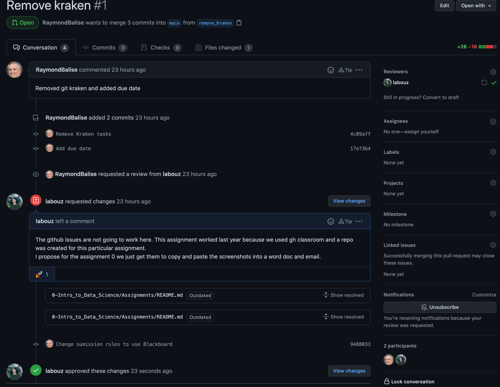
]
  
---
## Merge that ish...nom nom nom

Once your PR has been approved ✅
.pull-left[

- Merge

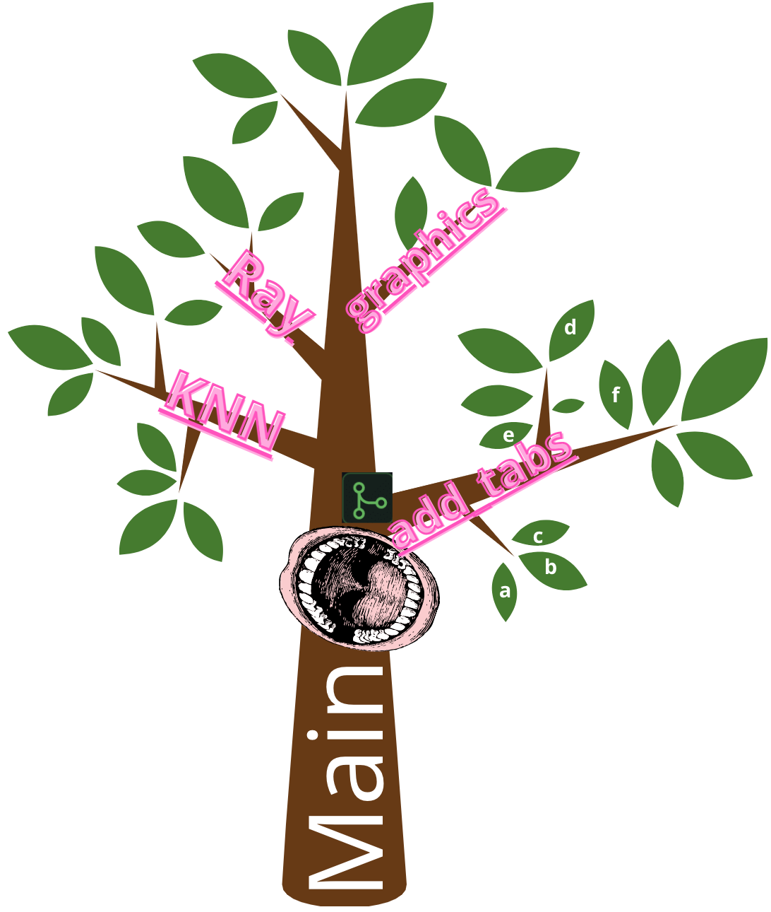
]
.pull-right[
- Chop off (delete) the branch 🪓

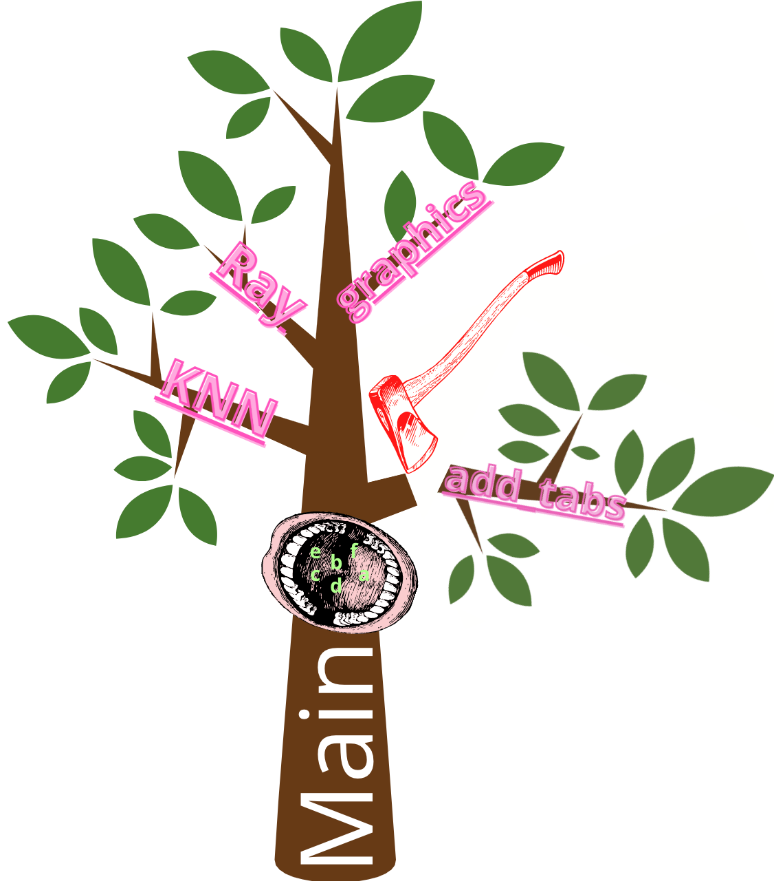
]

---

## Making Changes

Sometimes, before you (or someone else) can merge, changes need to be made. How would you know how a file has changed since the last version? --> a .red[DIFF]!

.pull-left[
With Git 🤩

</br>
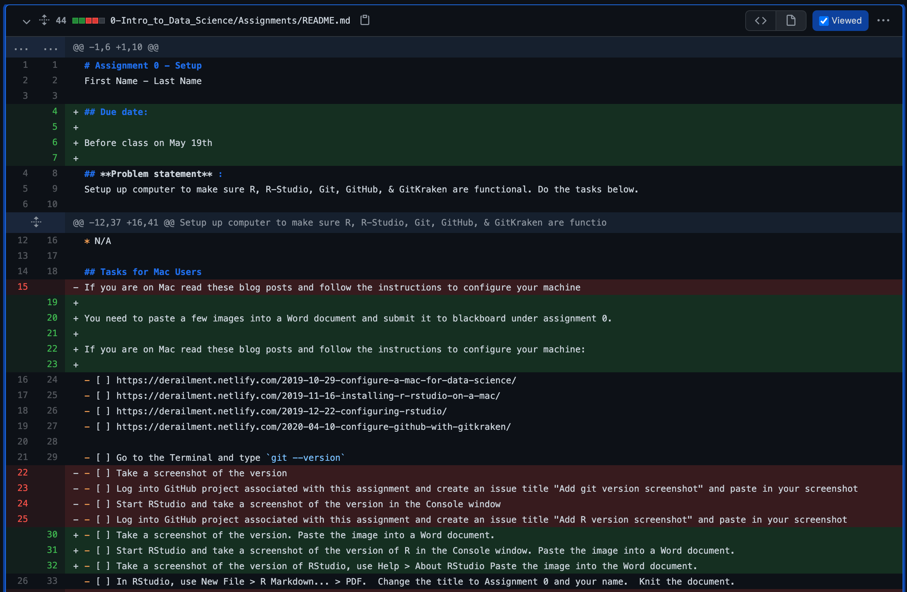
]
.pull-right[
Without Git 🥱

+ .li-sub[ Requires the use of extra tools like [UltraCompare](https://www.ultraedit.com/products/ultracompare/)]

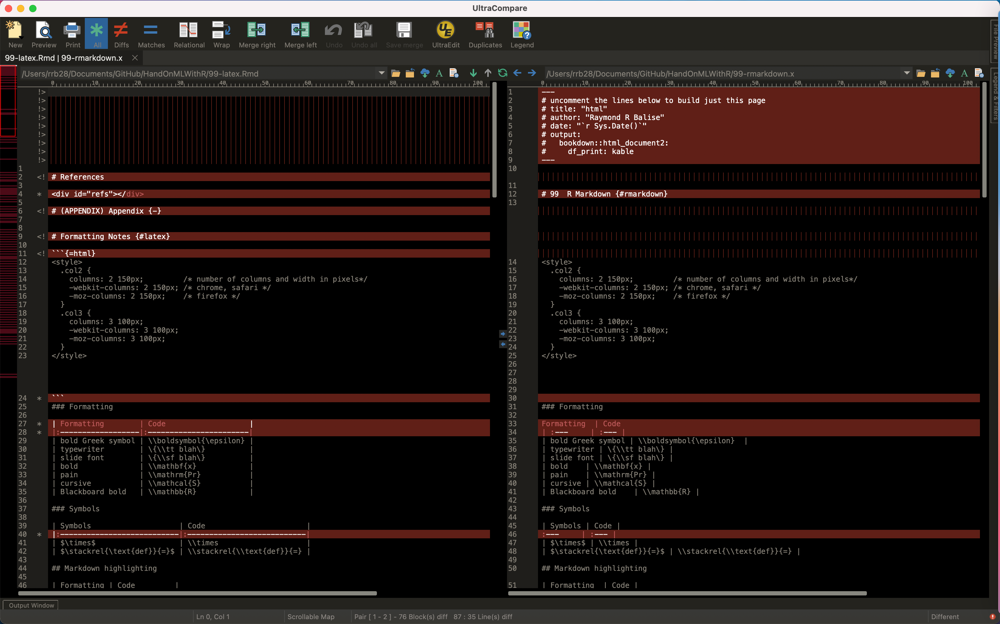
]


???
Figuring out what changed and merging requires additional tools.

---

class: segue

Resources

---

+ Git Handbook
  + https://guides.github.com/introduction/git-handbook/
+ Code Refinery
  + https://coderefinery.github.io/git-intro/
+ Happy Git with R
  + https://happygitwithr.com/
+ Oh Shit Git or Dangit Git
  + https://ohshitgit.com/  
  + https://dangitgit.com/en