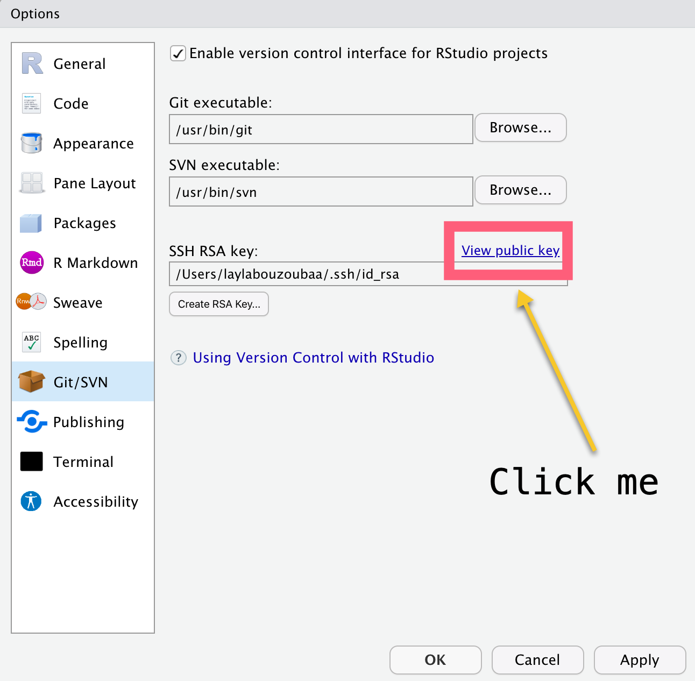
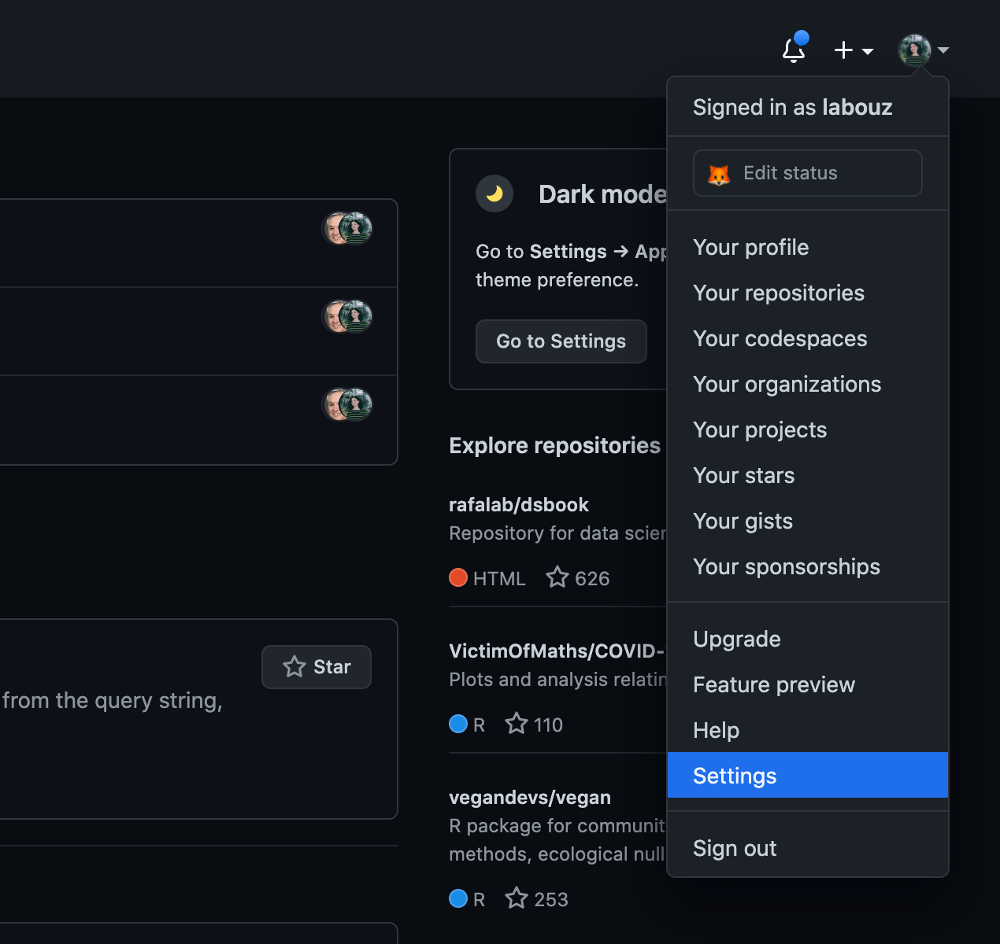

```{r setup, echo= FALSE}
knitr::opts_chunk$set(include = FALSE)
```


class: segue-gold, center


---


---


---
## What is GitHub?

.center[]

---

# How does GitHub fit in?

+ `git` is not GitHub!
    + `git` is a unix command/program that makes backup copies of computer files.
    + GitHub is a website that stores and combines backups.

+ If you want to back up your work (either a branch or the main copy) to another machine, you can .red[push] a snapshot to a website like GitHub.

+ If you have permission, you can get a copy of somebody else's backup, by making making a .red[clone] of their GitHub .red[repository].

+ If you are working on somebody else's project, you can .red[push] your branch into their repository and ask them to check it.

+ If they like it, they will .red[pull] it into their code.
+ You push it most of the way; they pull the last couple inches….

???
Layla we should do a quiz on the vocabulary.

---

# What GitHub is .red[NOT]

+ Git is not designed to use as a shared clipboard while teaching.

+ If you want to share code in real time use:  https://codeshare.io/

+ GitHub is .red[NOT] approved for storing research data

  + .red[Never] put protected health information on GitHub.
  + The University of Miami has its own "GitHub" -  https://code.miami.edu
     - ask us if you would like more details

---
## Let's Create an Account 🐙

.pull-left[
1. Go to https://github.com
1. Click "Sign Up" in the top right corner
1. Enter credentials with **UM account!**
]
.pull-right[

]

---

## Linking Git & GitHub 

First, let's make sure you and RStudio are introduced to Git!

There's a package called [`usethis`](https://usethis.r-lib.org/). This package provides you with a host of alternative and convenient functions to automate repetitive tasks and ease workflow.

If you did `Assignment 0`, this should have already been done. If you haven't - follow these steps:  
Introduce *yourself* to RStudio:

1. In the Console: `install.packages("usethis")`
1. In the Console: `usethis::use_git_config(user.name = "YOUR NAME", user.email = "YOUR .EDU")`

Now Git knows who you are `r emo::ji("smile")`

???
Your user.name will doesn't have to be you gh user name. it can be your name. if you're working on multiple machines, it can be something like layla-work and layla-personal. however, the email MUST be the one you provided to GH.
This will allow us to seamlessly push and pull changes from the central repository to our local repositories without having to enter our credentials every time
---

## Linking Git & GitHub pt. 2

Let's make sure you can make a repo and clone it to your computer.  

.pull-left[

]

.pull-right[

]

---

## Linking Git & GitHub pt. 3

.pull-left[

1. .red[Clone] the repo on GitHub (the central or remote repository) to your computer (local)

  1. .li-sub[If you are on a Mac, cmd+space and type "terminal"]
  1. .li-sub[If you are on a PC, search for "bash shell" in the Start Menu]

]
.pull-right[


 Hit enter and voila! `r emo::ji("sparkles")`

 
 

This exercise is to demonstrate that we can successfully .red[clone] a repository from GitHub to our computers. Don't worry about the commands just yet... `r emo::ji("wink")`

]

---

## Linking Git to RStudio

Now that we know Git is working, let's get to the fun part `r emo::ji("clown")`!

We need to connect RStudio to Git and GitHub

.pull-left[
.li-sub[
1. Open RStudio, go to *Tools > Global Options > Git/SVN*, and see if RStudio automatically found Git. ]


</br>
.small[*If you don't see it, we must tell RStudio where to find it.*]
* .li-sub[Mac - it's usually at `/usr/bin/git`]
* .li-sub[Windows - looks something like this: `C:/Program Files/Git/bin/git.exe`]
]

.pull-right[
.li-sub[ 
2. Next, is the cool part! WE are going to create `r emo::ji("key")`  that will link our computers to GitHub. These keys store our GitHub credentials so that we don't have to enter them every time!  
    * Enter SSH Keys!! They are cryptographic and a *more secure* way to log into a server than your password alone. 
    
]


]

???
For Mac: The keyboard shortcut “command + shift + g” will summon “Go To Folder”
For Windows: Be careful to make sure to point to the file that has *bin! NOT cmd!!!
After, restart rstudio

SSH keys are nearly impossible to decipher by brute force alone. 
---

## Linking Git to RStudio pt.2

.pull-left[
Now that you have some understanding of SSH keys. Let's create them!


]
.pull-right[
After you hit .red[create], RStudio will automatically generate the keys and store them locally. It will also generate a key fingerprint and a randomart image.

.orange[What is this?] - the point of the image is not super important for our case but essentially it is graphic representation of the key you generated - another visual security measure. 


]


???
the Randomart can be very useful for a user using a connection via SSH to connect often to the same server: if he added the "-o VisualHostKey=yes " option to his SSH command

---

## Telling your SSH-Agent about your new `r emo::ji("key")`

Don't worry too much about what the `ssh-agent` is but know that it is the **key manager for SSH**. It runs in the background of your system ready to present the public key to the server requesting it.


Now, let's store the keys to our `ssh agent`. Open either the Terminal or Git Bash:

.pull-left[
**For Mac OS**
.li-sub[1. `eval "$(ssh-agent -s)"`
2. If you get a "permission denied", rerun the above command placing `sudo` before it. Hit Enter, then `exit`
3. `$ ssh-add -K ~/.ssh/id_rsa` *note: add the `-K` option if you chose to set a passphrase so that it can get stored as well.*
]

]
.pull-right[
**For Windows**
.li-sub[
1. `eval $(ssh-agent -s)`
2. Add key - `ssh-add ~/.ssh/id_rsa`
]


]

???
source:https://smallstep.com/blog/ssh-agent-explained/ 
the key manager holds your keys and certificates in memory, unencrypted, and ready for use by ssh. think of this interaction as a handshake. your computer presents the public key to the server, the server generates and sends a brief random message in which the your computer will sign it using the private key. Your computer will then ask the SSH agent to sign the message and send it back to the server and if the keys match then request is approved. the sever has proof that your computer does in fact hold the matching private key.

Again, don't worry so much about the specific commands right now.

---

## Connecting the SSH Key to GitHub

.pull-left[

Now, go back to RStudio. Open the Git options again and click on "View public key"



Copy that.

]

.pull-right[

Open GitHub and navigate to your profile settings in the upper right corner.



Under "SSH and GPG Keys", click "New SSH Key"


]

---

## Wrap Up `r emo::ji("wrap")`

After you've Copy and Pasted your public SSH key to GitHub and confirmed it by typing in your password, let's confirm everything works!

.pull-left[
.red[*This is will be the repo for this class!*]

1. Make a new repo on GitHub  
  .li-sub[- be sure to .red[**start it with your last name**]
  - set a description
  - make it .red[**private**]
  - check the box - .red[YES] initialize README
  - skip the `.gitignore` - use [Ray's](https://gist.github.com/RaymondBalise/300d99c2b6450feda3ed5a816f396191)]

1. Clone the new GitHub repo on your computer via RStudio
  .li-sub[- Like last time, copy the repo URL]
  .li-sub[- *File > New Project > Version Control > Git*]
]

.pull-right[


]

???
use Ray's gitignore file for R programming. it is very comprehensive and almost bullet-proof against phi


---

## Wrap Up `r emo::ji("wrap")` pt. 2

.pull-left[
1. Open `README.md` and write a sentence about yourself. 
  - .li-sub[`README` files are really important. We expect you to add to your `README` file later with relevant information.]
1. Save it.
1. Navigate to the Git Pane
1. Click on the checkbox next to the filename
1. Click the "Commit" button
  - leave a meaningful commit message
1. Press Push! 
]

.pull-right[


Did RStudio challenge you for credentials?! 

]

???

readme - This may be the beginning of your digital portfolio so pretend your future employers will see this. Give them adequate information so they know exactly what to expect in this repo and why the repo was created.

---

## Creating a PR and Code Review  

Once you have pushed changes to a new branch, GitHub notices and will ask if you want to create a PR.

You can also navigate to the branches tab of your repo and click on "Open Pull Request"


If you've been tagged for a code review, GitHub will notify you and you can click on start review to be able to leave comments directly on GitHub and approve or request changes from your peers.


---


class: segue

Resources

---


+ Git Handbook
  + https://guides.github.com/introduction/git-handbook/
+ Code Refinery
  + https://coderefinery.github.io/git-intro/
+ Happy Git with R
  + https://happygitwithr.com/
+ Oh Shit Git or Dangit Git
  + https://ohshitgit.com/  
  + https://dangitgit.com/en