- [Last episode,](#last-episode)
- [Demo: Setup Git](#demo-setup-git)
- [Foundations of Git:](#foundations-of-git)
- [Demo: Create local repo](#demo-create-local-repo)
- [Demo: Connect Repo](#demo-connect-repo)
- [Demo: Branching](#demo-branching)
- [Demo: Deleting a branch](#demo-deleting-a-branch)
  
#### Last episode,

We went over the basic principals of version control with Git and GitHub within GUI's such as RStudio and GitKraken. Today, we will review some of those prinicipals and practice them "out of the box" within the command line (terminal).  

I swear, this will be fun. And even if you hate it now, you'll thank me later because there are command you should know and understand in case you get stuck. GUI's are great but sometimes they have bugs. Bugs are gross. We shold be able to rely on our understanding of basic git commands to keep calm, and carry on (pest control).  

Let us review:

- **No github without git**
- Git = source control system
- Distributed = full history of all changes (all work done on local then can sync with remote)
  - Free and open source
- Pros: fast, scalable, can work disconnected (bc it’s distributed), powerful and easy, branching (new feature, new branch), pull requests (enables collaborating - intrinsically brings discussion and reviews thus improving quality of code)
- Cons: different (mind switch if you’re used to more traditional control system), learning curve, tools(most powerful on the command line, but gui can be useful), large binary files
- Github  = hosting service for git repositories – global – runs on top of git but offers a lot of other features – free and paid options

Materials:

- Git - available on any OS
- An editor
  - RStudio
- GH account

#### Demo: Setup Git

- Terminal/command line is a direct line for human to interact with computer, just like an application but better
- Let’s first make sure everything is set up
  - `git –version`
- Configure git locally – globally
  - Git bash
  - Git config --global
    - User.name “lb”
    - User.email “email”
  - Git config –edit –global
    - To see configurations
    - Will open on default editor
- Git config file in the local user directory

#### Foundations of Git:

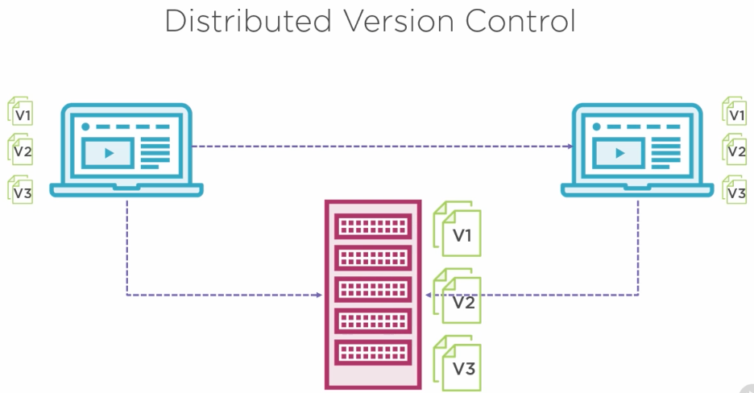

- Three states- promotion based system – ALL LOCAL
  - Committed
    - Data stored in local db
  - Modified
    - File has been changed but not committed
  - Staged
    - Modified file has been marked to be part of the next commit snapshot
- Three areas of git
  - Working directory
  - Staging area
    - Waiting to be committed
  - .git repo
    - Once a commit is made
    - When files are committed they are moved to this local directory
    - Entirely managed by git
    - Also created when we clone source from GitHub
  - 4th area – remote repo
    - Github
- Common commands:
  - All start with `git`
  - `git config`
  - `git init`
    - Create an empty repository
    - Initialize git
  - `git clone` 
    - Download a project from a remote
  - `git add`
    - Prepare a file for staging
  - `git commit -m "yourcommitmessage"`
    - Commit changes to a local repository 
    - Include a message

#### Demo: Create local repo

- Create a local repo
  - `mkdir "./bst692_git"`
  - Hint: use tab to autocomplete
  - Bash/terminal now knows you're in the directory
  - Note: not a git directory, yet

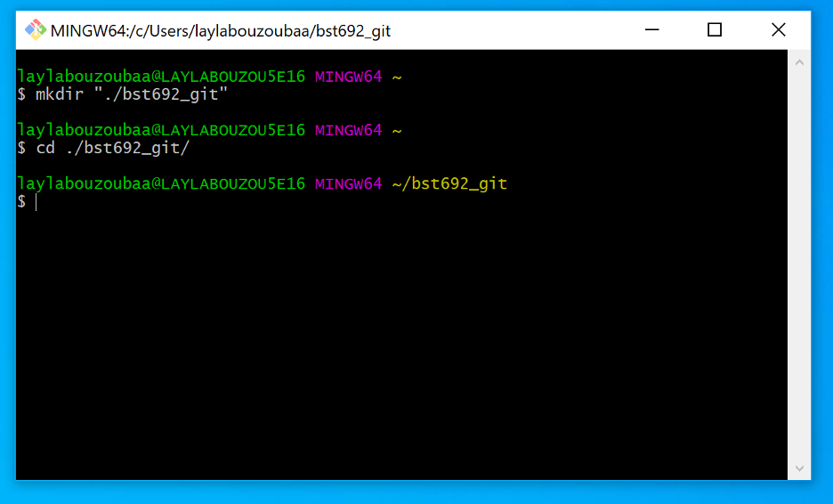
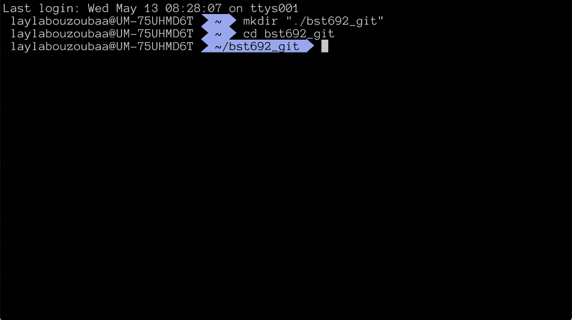
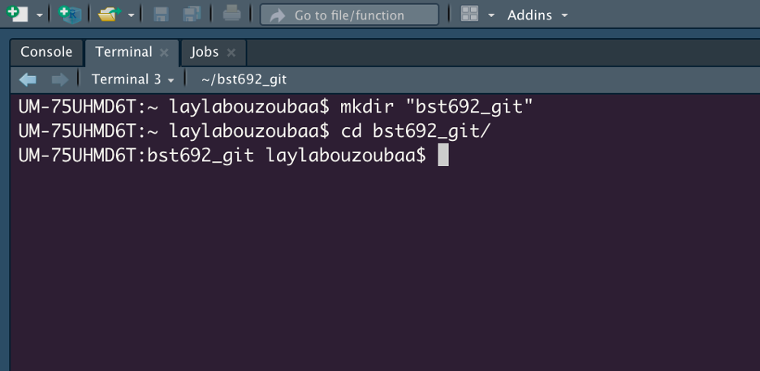

- Initiate git
  - `git init`
- See what is in the folder
  - `ls -la`
- Basic commands to work with git
  - `git status`
    - No commits yet obviously
  
  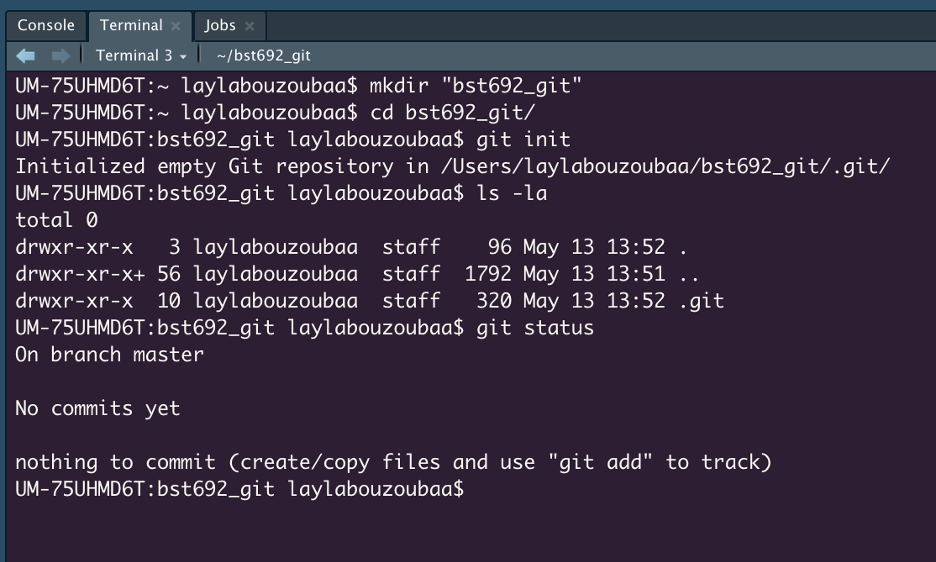

  - Create a new file
    - `touch README.md`
  
  

  - Stage it
    - `git add README.md`
  - `git status`
  - Commit
    - `git commit m "make readme"`
  - `git status`
    - No commits just yet but git is now tracking the readme file
  
  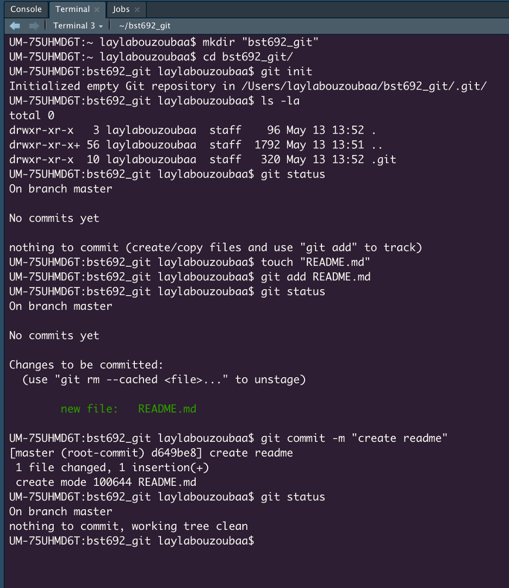

  - You an track multiple files at once!
    - `git add .`
    - `.` will add all the new files created/modified but not added to git
    - Git will start tracking all three files
      - .gitignore, analysis1.R, analysis2.R
        - .gitignore starts with a "." and is therefore hidden
        - place files in the .gitignore and git will know to not track these files --> DATA files are a good thing to ignore

  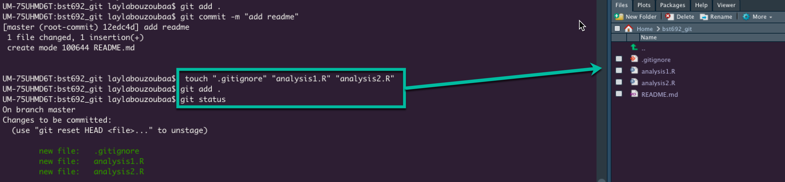

  - See our commit history
    - `git log`
    - OR `git log -1` to see just the last commit
  - How can I do an add and a commit in one go?
    - `git commit -am "ignore and analysis files"`
  - `git log`

  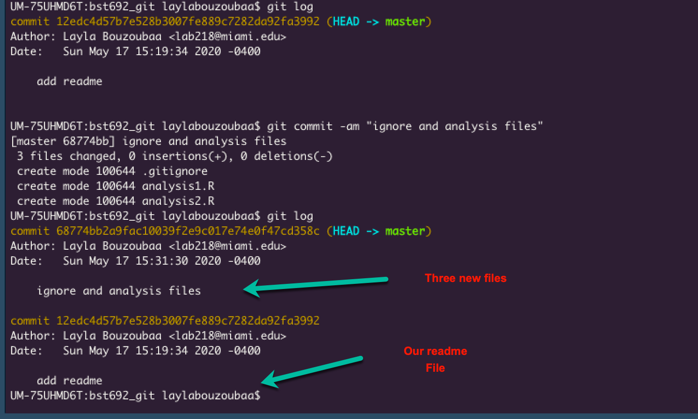

*Scenario*: After working on "analysis2.R", you realize that it is basically a better version of "analysis1.R". You only want to keep "analysis2.R" but like the idea of keeping "analysis1.R" as your code scratch pad (I do this all the time...). What do we do??

Well, at the end of the day, we want "analysis1.R" to be ignored by Git. But wait, we have already committed these files. How do we tell git to stop tracking "analysis1.R" so we can ignore it? 

Like this!:

1. We need to undo the last commit which had "analysis1.R"
   1. `git reset --soft HEAD~1`
      1. `git reset` = undo commits
      2. `--soft` = preserves the changes made to the files
      3. `HEAD~1` = only the LAST commit (remember in the log, the last commit appears at the top so the last commit will always be ~1)
2. Unstage "analysis.R"
   1. `git reset HEAD analysis1.R`
   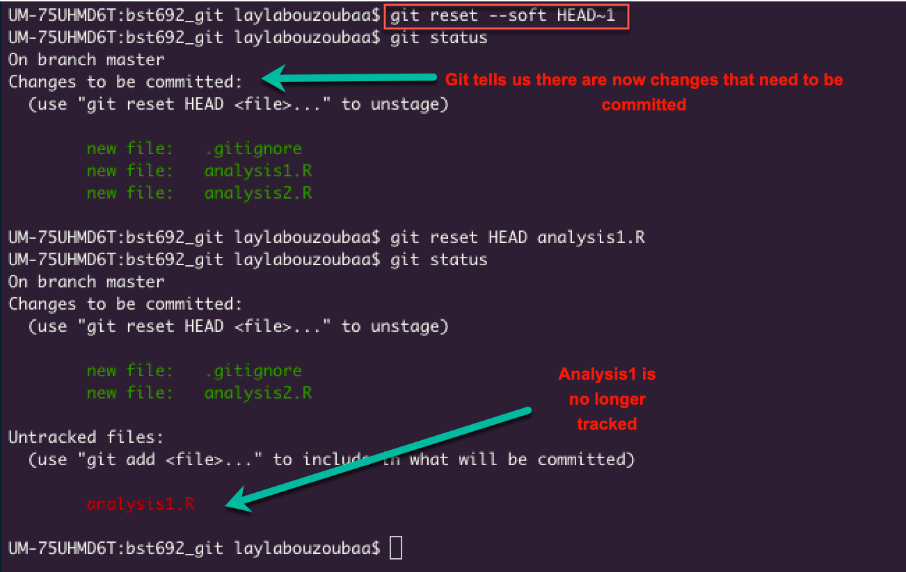

3. Then we modify the .gitgnore file
   1. add name of file, save
   2. `git status`
   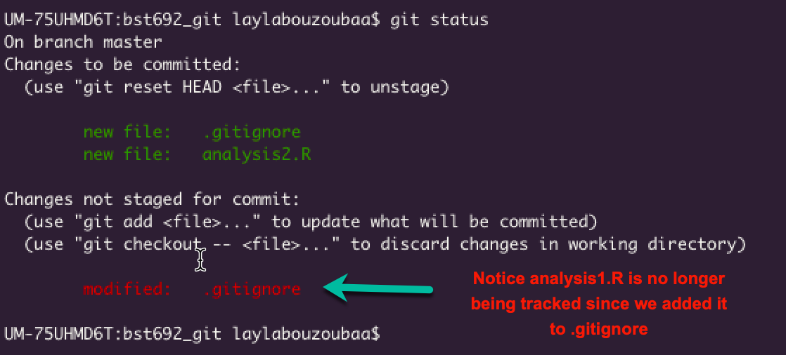
4. `git add .`
5. `git commit -m "move analysis1.R to gitignore"`

Remember, everything we have just done was done locally, on our computer. We still need to connect to a remote (online repository aka GitHub)!

Some notes on GitHub:
- Again, GH is a web-based hosting service for git
- Extends what we can do with git
- It’s popular ~ 40 million developers worldwide
- Enables collaboration
- GH main features
  - Lots of code
  - Pull requests
    - Request their changes be merged with another branch, usually followed by a code review
  - Issues
    - Ways to mark bugs, feature enhancements, etc

#### Demo: Connect Repo
- Make a new repository
  - https://www.github.com
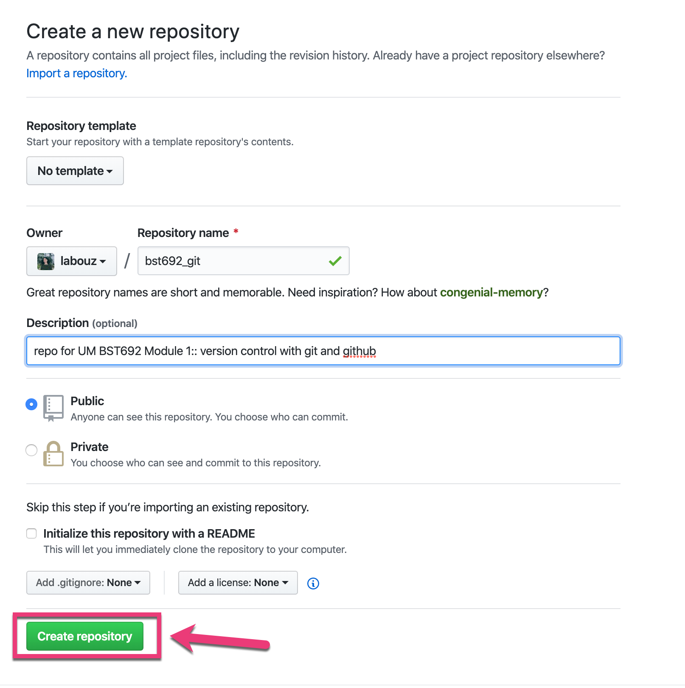

- Copy the git URL
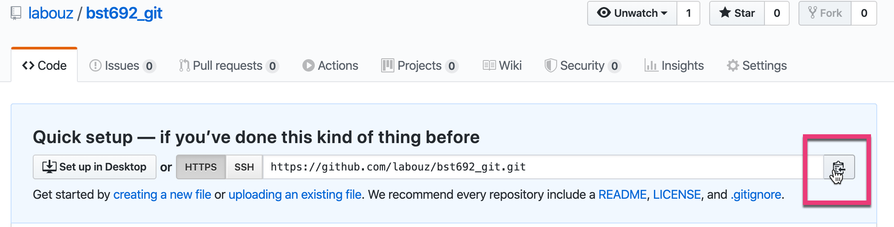

- Link it to local repository
  - `git remote add origin URL`
- Double check it's there
  - `git remote --v`
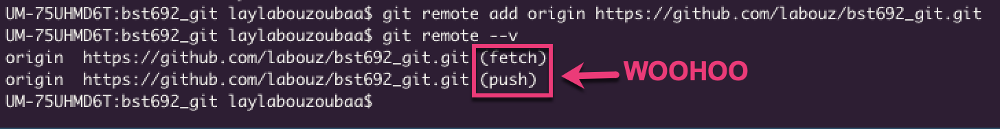

- Let's push our work!
  - `git push origin master`
    - origin = remote
    - master = main tree
  
*Scenario*: Your colleague wants to join your project. You've been making all your changes to `master` and you're worried they may join and mess things up. What do you do?

That's what branches were created for! You have already seen how to create a new branch in RStudio. Hopefully, you also remember why they are important. If not, let's review:

- Branches are important for code development
  - Wenever you need to create a new feature, fix a bug, or rewrite any of your code, it's a good idea to create a new branch so that none of your changes affect the "master" version of the code. 
- How?
  - `git branch myNewFeature`
    - this command creates the new branch
    - it's good practie to create a new branch for each new feature and name your branch that feature
  - `git checkout myNewFeature`
    - this command switches you over from working on `master` to `myNewFeature`
  - OR simply adding `-b` will combine the two steps above (creating and switching over) into 1
    - `git checkout -b myNewFeature`
  
#### Demo: Branching

We are going to create a scatterplot in analysis2.R in our new branch `scatterplot`

- `git checkout -b scatterplot`
- modify analysis2.R
  - ggplot2
    - x = wt
    - y = mpg
  - geom_point
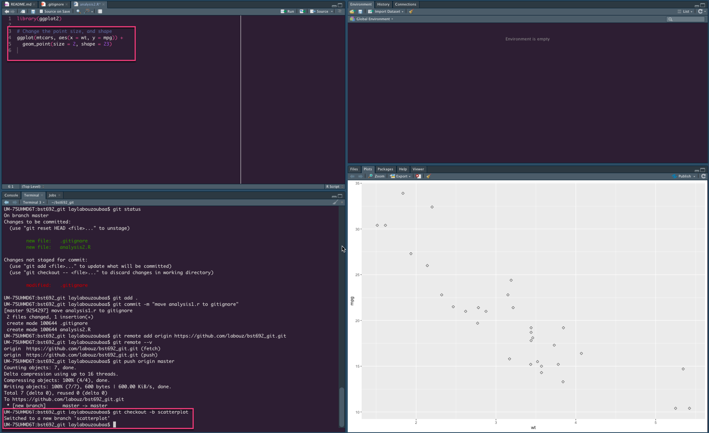

- Save
- `git add analysis2.R`
- `git commit -m "add mtcars scatterplot"`

Cool, but what if we want this version of "analysis2.R" to be the final version (for the moment)?

Demo: Merging

- switch back to `master`
  - `git checkout master`
- `git merge scatterplot`
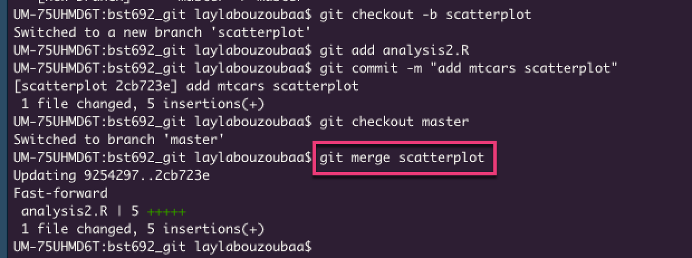

Wait, aren't we missing something??

YES! 

We still need to push our new changes to the remote (GitHub) so our colleague can see our changes too :)

- `git push origin master`

That's it! BUT, we want to be tidy and not have our repos cluttered with so many unused branches so it's good practice to delete a branch once you're comfortable with your changes and want to move on. 

#### Demo: Deleting a branch

- Local:
  - `git branch -d scatterplot`
- Remote:
  - `git push origin --delete scatterplot`
  - Note: if you noticed carefully, we never actually pushed our branch to the remote in this exmple. We did our merge to master LOCALLY and then pushed those changes to the remote so GitHub never saw our branch `scatterplot` :) 
    - IRL: you will likely make several commits and push to a branch before merging. Once you push to the branch then you will see that branch on GitHub! 