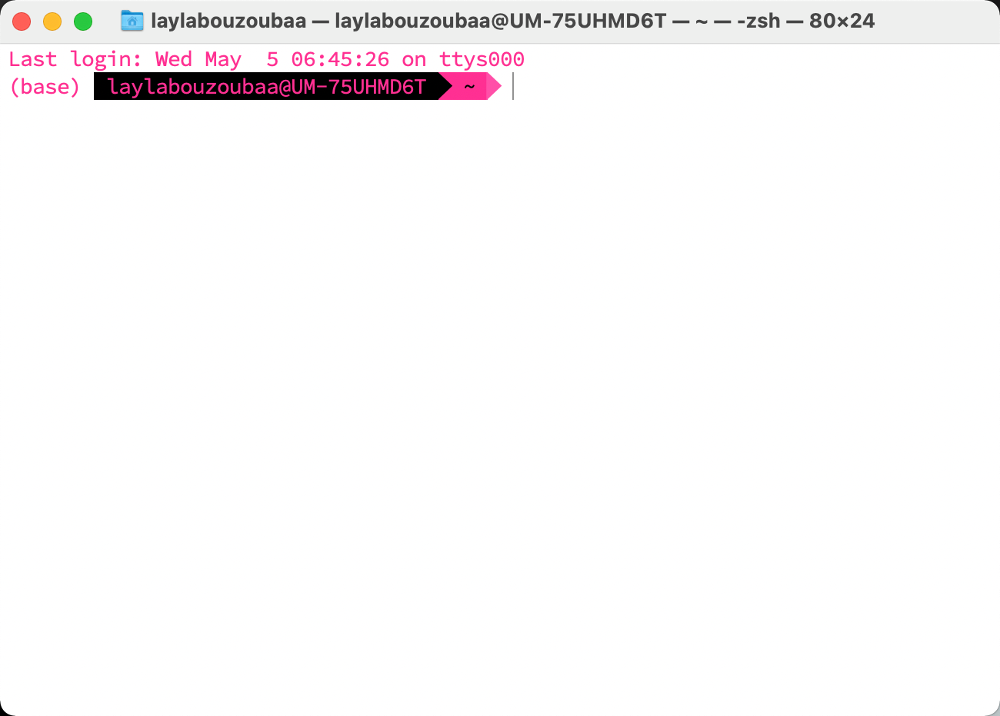
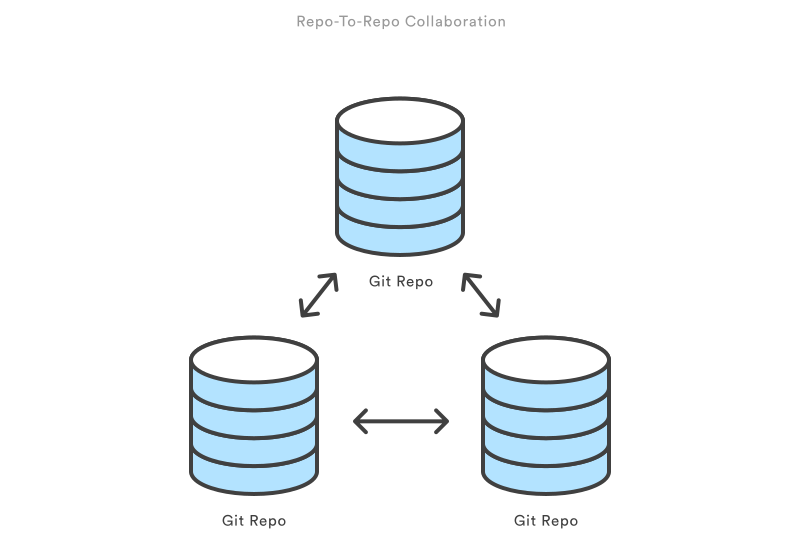

```{r setup, echo= FALSE}
knitr::opts_chunk$set(include = FALSE)
source("../../helpers/color_funs.R")

```

class: segue-gold, center

Git and the Command Line (The Powerful Way)

---


---
## This is the Command Line

* Mac - Cmd+space > "Terminal"
* Windows - Search Bar > "Bash Shell"

.pull-left[

]

.pull-right[

]

.li-sub[Git commands cheat sheets! https://education.github.com/git-cheat-sheet-education.pdf or https://gist.github.com/hofmannsven/6814451]

???
Remember this from Wednesday. The shell is how we can interact with the computer directly. 
---
class: segue-yellow, center

Useful git commands

---

# Git Syntax is Powerful
 
.center[`git` .orangeCode[`command`] .blueCode[`git-options`] .redCode[`command-options`] .purpleCode[`operands`]]

+ `git` .blue[`--version`]
  + Show your git release version
  
+ `git` .orange[`config`] .blue[`--global`] .red[`user.name`] .purple[`"your name goes here"`]
  + Sets your user name for all things git.
  + You can specify if you want the changes to apply to a machine (.blue[--system]) , all your work (.blue[--global]), or a directory (.blue[--local]).  You can sometimes use a single letter abbreviation and a single 
  + Git uses a . to separate out two pieces of the configuration setting.  The .red[`.`] is setting the .red[`user.name`]  value in the user section of the configuration.

---


## Initiating git in an exsiting project

.center[.blue[`git init`]]

.center[]

* The `git init` command creates a new Git repository. It can be used to convert an existing, unversioned project to a Git repository or initialize a new, empty repository. 

* This is usually the first step as other git commands are not available for use outside an initialised repository

???

Transform the current directory into a Git repository. This adds a `.git` subdirectory to the current directory and makes it possible to start recording revisions of the project.

If you've already run `git init` on a project directory and it contains a `.git` subdirectory, you can safely run git init again on the same project directory. It will not override an existing `.git` configuration.
---

## Cloning an exisiting repo

</br>

.center[.blue[`git clone <REPO URL>`]]   

</br>
*Purpose: repo-to-repo collaboration*

.pull-left[
+ To obtain a development copy of a project that has already been set up in a central repository

+ Generally a one-time operation

+ The clone will become your working copy and all operations are managed through your local repository
]
.pull-right[
 
.footnote[*Atlassian Bitbucket*]
]


???
`git init` and `git clone` can be easily confused. At a high level, they can both be used to "initialize a new git repository." However, `git clone` is dependent on `git init`. `git clone` is used to create a copy of an existing repository. Internally, `git clone` first calls `git init` to create a new repository. It then copies the data from the existing repository, and checks out a new set of working files.

It's easier to use the HTTPS URL but if you want to use SSH to clone a repo, use `git clone ssh://<SSH PATH>`
---

## Creating and switching branches 🌳

</br>

.center[.blue[`git checkout <BRANCH NAME>`]]   
.center[.blue[`git branch <BRANCH NAME>`]]


.pull-left[
*Purpose: repo-to-repo collaboration*
+ To obtain a development copy of a project that has already been set up in a central repository

+ Generally a one-time operation

+ The clone will become your working copy and all operations are managed through your local repository
]

.pull-right[
*Create and switch branches shortcut*

.blue[`git checkout -b <BRANCH>`]


]

???
the `-b` tag tells git to create a new branch while simultaneously switching into it.
---

## What about deleting a branch? 🪓

</br>

**LOCALLY**
.center[.blue[`git branch -d <BRANCH NAME>`]]  
+ .li-sub[`-d` will delete the branch only if it has already been pushed and merged with the remote branch ]

+ .li-sub[use `-D` instead if you want to force the branch to be deleted, even if it hasn't been pushed or merged yet]

**REMOTELY**
.center[.blue[`git push origin --delete <BRANCH NAME>`]]  

+ .li-sub[Delete from GitHub]
+ .li-sub[⚠️ `error: unable to push to unqualified destination: remoteBranchName....` =  it has already been deleted from the remote]
+ .li-sub[Sync your branch list with `git fetch -p`]

???
Watch out - someone may have already deleted the branch remotely from GitHub if it has already been merged. If it has already been deleted you will get an error like `error: unable to push to unqualified destination: remoteBranchName The destination refspec neither matches an existing ref on the remote nor begins with refs/, and we are unable to guess a prefix based on the source ref. error: failed to push some refs to 'git@repository_name'`

---

## Saving Changes

+ .blue[`git add`] - adds change in the working directory to the staging area
   + .li-sub[`git add .` - adds everything that is untracked to staging ⚠️]
   + .li-sub[`git add <filename>` - adds a specific file to staging]
+ .blue[`git commit -m "this is my message"`] - record changes
   + .li-sub[core building blocks of a Git project]
   + .li-sub[snapshot of the state of the project at that point in time]
   + .li-sub[now would be a good time to run .blue[`git status`] to check the state of the working directory]

+ .blue[`git diff`] - comparing changes
   + .li-sub[This shows you the same information you would find in RStudio's Git Pane when you select "Diff"]

+ .blue[`git stash`] - temporarily shelves changes you've made
   + .li-sub[likely be used when you need to work on something else but the changes are not ready to be committed. .blue[`git stash pop`] to remove changes from stash back to working dir.]

???
`git add` doesn't really affect the repo in any significant way. `git add` and `git committ` are part of the fundamental git workflow. these two ( plus `git push`), are essential for any git user to understand.

Running `git diff` in the command line will give you some additional information like the input sources of the diff and some meta data. you will most likely not need this information. the numbers in the output correspond to Git hash identifiers. What you want to focus on is the markers for changes - these start with `---` and `+++` to differentiate the changes made from each version of a file - and the diff chunks, these include the number of lines that have had additions and the number of lines that have had deletions.

The default behavior of stashing is to stash staged and unstaged changes. It will *not* stash ignored files or new files that have never been staged. 

---

## Ignoring files

.center[.blue[`.gitignore`]]  

+ This is a hidden file that tells `git` what to *not track*

+ See [Ray's gist](https://gist.github.com/RaymondBalise/300d99c2b6450feda3ed5a816f396191) (a GitHub snippet) for a safe and comprehensive ignore file for R programming

+ This file must be *edited and committed by hand* when you want to ignore new files (i.e there is no specific commands to ignore files)

+ i.e., dependency caches, compiled code, hidden system files (.DS_Store), personal config files (blah.Rproj), files generated at runtime (.log) 

???
Git sees every file in your working directory as one of three things: tracked, untracked or ignored. 

---

## Inspecting your repo

</br>
.center[.blue[`git status`]]  

+ displays the status of the working directory and stagin area

</br>
.center[.blue[`git log`]]  

+ displays committed snapshots

+ defaults to displaying the entire commit history

+ .blue[`git log -n <N>`] to see only the last N commits 

+ .blue[`git log --author = <NAME PATTERN>`] to see only commits by name matching a given pattern

---

## Collaborating 🤼

.pull-left[
</br>
.center[.blue[`git remote -v`]]  

+ display the remote URL of your repo

+ modify the remote URL by using `add` - .blue[`git remote add origin <URL>`]

.center[.blue[`git push origin <BRANCH>`]]  

+ export your local changes to a specific branch on the remote repository

.center[.blue[`git pull origin <BRANCH>`]] 

+ downloads content from remote
]

.pull-right[


.footnote[*Atlassian Bitbucket*]
]

???

`git push` can be considered a "download" command
`git fetch` and `git pull` are considered an "upload" command
---

## Workflow RECAP 🧢

1. .blue[`git init`] OR .blue[`git clone <URL>`]
1. .blue[`git branch newFeature`]
1. .blue[`git add feature.R`]
1. .blue[`git commit -m "adding new feature"`]
1. .blue[`git push`]
1. Open PR and merge changes from GitHub
1. Delete branch off remote from GitHub OR .blue[`git push origin --delete newFeature`]
1. Delete branch locally: .blue[`git branch -d newFeature`]
1. .blue[`git checkout main`]
1. .blue[`git pull`] - get your local copy up to speed with the changes you just merged
1. .blue[`git fetch -p`] - sync up branches with remote
---

class: segue

Other useful things that may help you

---

# Customizing `git` Commit Messages

1) Make a file ~/.gitmessage with these three lines of text:

```
Replace this line with a one-line meaningful summary
Why this change is needed:
What this change accomplishes:
```

2) Tell git to use your message:

.center[`git` .orange[`config`] .blue[`--global`] .red[`commit.template`] .purple[`~/.gitmessage`]]

3) Tell git to use a rational editor: 

.center[`git` .orange[`config`] .blue[`--global`] .red[`core.editor`] .purple[`"atom --wait"`]]

---

## Configuring Git

+ `git config --global user.email "<YOUR EMAIL>"`

   + `--local` - the default setting `git` will write to if no other option is passed
   + `--global` - this level is user-specific; values are stored in a file on the user's home directory
   + `--system` - configurations applied across an entire machine

+ `git config --global core.editor "subl -n -w" (MAC)`
   + `git config --global core.editor "'c:/program files/sublime text 3/sublimetext.exe' -w"` (Windows 64x)
   
---


class: segue

Thinking About Backups

---

# Big Projects that are Not Code

+ For a major text project like a thesis, you will likely use  .red[a big Word file].

+ Adding .red[summary notes] on what changed with each save is not a "normal" thing to do.

---

# Big Projects Involving Code

+ A major programming project like an R package will have many files.
    + A bunch of R files with different functions
    + A bunch of documentation files
    + Information about the package itself
    + Maybe dataset files

+ Adding a .red[summary message] of the things you are adding/modifying as part of a "change" is a must for:
    + Debugging
    + Patch notes telling users what changed on a new release  

+ Each summary message can describe changes to a single file or a summary of a big pile of new/edited files.

---

# Real life …
.small[
+ Say you are making an R package.

+ When you add a function you will add documentation. Say the documentation for the new function involves text describing what your function does along with 2 pictures.  You will want to add a single summary note describing the addition of the text and the pictures.  That is, .red[3 files were part of this change].

+ While working on your documentation, you notice and fix a typo in the documentation of a totally different function.  .red[You will have now created/modified 4 files].  

+ You will want to leave one note for the files associated with your function and a second note for the other fix.

+ `git` lets you specify which files belong with each change note. 

+ You write a note, then take the snapshot of files.  Then write a second note and take a second snapshot.
]
---

# Summary Messages – Commit Messages

+ Before you take a snapshot of your files, you will:
  + Move them onto the .red[stage] and shine a spotlight on the files that are part of this change.
  + Write a note describing the change.

+ Snapshots of your files are called .red[commits] and the message is called a .red[commit message].
+ By default, `git` does not take a snapshot of every change!

+ You have to tell it which changes matter.
+ Save often, commit when something is ready to share.

+ Commit messages should not include the word "***and***".

---

# Back to the Example

+ Before you take a snapshot, you .red[put the files onto the "stage"].

+ After all the files are .red["staged"] you write a note.

+ Once the note is done, you .red[commit the note and changes].

+ This two-step process of staging and later committing .red[allows you to bundle] together all the related files on the stage.
<br>

+ In my example, I would stage my new function documentation's text file and the image files, write a note, and make the commit.  The commit clears the stage.

+ I would then stage the fix to the other documentation and do a second commit. (Then get coffee.)


---

class: segue

Resources

---

+ [Git Cheatsheet](https://www.atlassian.com/git/tutorials/atlassian-git-cheatsheet)
+ Git Handbook
  + https://guides.github.com/introduction/git-handbook/
+ Code Refinery
  + https://coderefinery.github.io/git-intro/
+ Happy Git with R
  + https://happygitwithr.com/
+ Oh Shit Git or Dangit Git
  + https://ohshitgit.com/  
  + https://dangitgit.com/en
+ https://gitexplorer.com/
+ Pro Git Book
  + https://git-scm.com/book/en/v2

